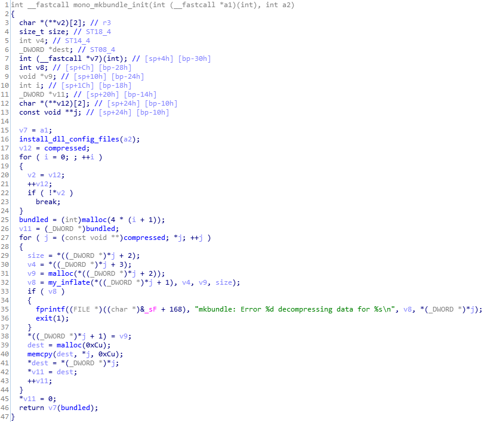

# Mono Rebundle
A utility for bundling Xamarin/Monodroid DLLs into an android shared library (libmonodroid_bundle_app.so).

Useful for bundling back .NET DLLs extracted using this tool [mono_unbundle](https://github.com/tjg1/mono_unbundle).

## Configuration
After the first launch there will be config.json created and you have to set the following information:
- "AndroidNdkDirectory" - Path to Android NDK
- "BundleApiPath" - Path to mkbundle-api.h(included in the project)
- "SupportedAbis" - Supported ABIs, semicolon separated
- "ToolPath" - Path to a directory containing mkbundle.exe

## Command line options
#### help - Display more information on a specific command.
#### verison - Display version information.
#### produce-stab - Produce stab only, do not compile.
Options:
-p, --path - Required. Path to a directory containing assemblies to bundle. 
#### link - Link into libmonodroid_bundle_app.so

## Usage
1. Produce a stub. Temp.c will be created inside temp directory in your running directory. 
2. Make adjustments to temp.c. 
3. Link into libmonodroid_bundle_app.so. 

In my case I had to edit mono_mkbundle_init function in temp.c in order to make it match the original one. 
 

# Credits
Xamarin.Android - The utility uses slightly modified version of [Xamarin.Android](https://github.com/xamarin/xamarin-android) project licensed under [MIT License](./LICENSE_XamarinAndroid).

# License
The utility is licensed under [MIT License](./LICENSE)).
